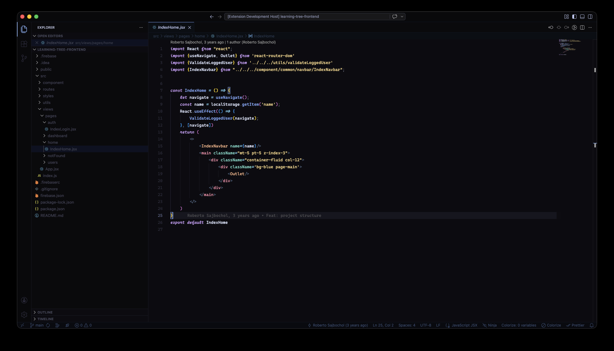

# Deep Slate

A minimal dark VS Code theme with a near-black background and vivid syntax colors. Designed for long coding sessions across multiple languages.

## Screenshots



## Features

- Deep near-black background — easy on the eyes
- Vivid, high-contrast syntax palette
- Italic keywords with Cascadia Code cursive variant
- Full support for: JavaScript, TypeScript, React/JSX, Svelte, Vue, Astro, PHP/Laravel/Blade, Java, Kotlin, Python, Go, Rust, CSS/SCSS, JSON, YAML, SQL, Markdown

## Recommended Font

This theme is designed to be used with **[Cascadia Code](https://github.com/microsoft/cascadia-code)** — a monospace font with ligatures and cursive italics developed by Microsoft.

```bash
brew install --cask font-cascadia-code
```

> Font settings (size, weight, ligatures) are applied automatically when the theme is active. If Cascadia Code is not installed, VS Code will fall back to Consolas.

## Installation

1. Open **Extensions** in VS Code (`Ctrl+Shift+X`)
2. Search for `Deep Slate`
3. Click **Install**
4. `Ctrl+Shift+P` → **Preferences: Color Theme** → select **Deep Slate**

## Color Palette

| Role         | Color     |
|--------------|-----------|
| Background   | `#0c0c10` |
| Variables    | `#dce4ff` |
| Keywords     | `#d0a0ff` |
| Functions    | `#82aaff` |
| Strings      | `#f2d185` |
| Numbers      | `#ffb86c` |
| Classes      | `#ffb86c` |
| HTML Tags    | `#ff7c9e` |
| Attributes   | `#7fd9cc` |
| Operators    | `#80d9ff` |
| Comments     | `#545c7e` |

## Recommended Settings

Add these to your `settings.json` for the full minimal experience:

```json
"editor.minimap.enabled": false,
"editor.scrollbar.vertical": "hidden",
"editor.scrollbar.horizontal": "hidden",
"editor.overviewRulerBorder": false,
"editor.glyphMargin": false,
"editor.folding": false,
"editor.padding.top": 16,
"editor.padding.bottom": 16,
"editor.smoothScrolling": true,
"editor.cursorBlinking": "smooth",
"editor.cursorSmoothCaretAnimation": "on"
```

## License

MIT © [Roter-S](https://github.com/Roter-S)
